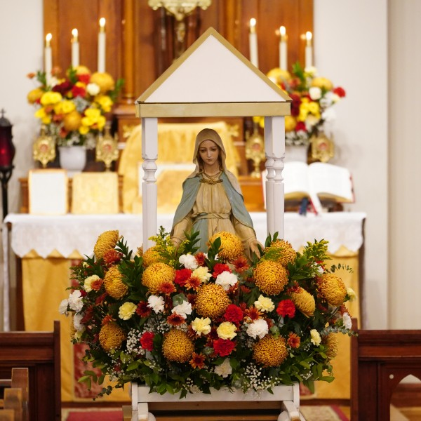
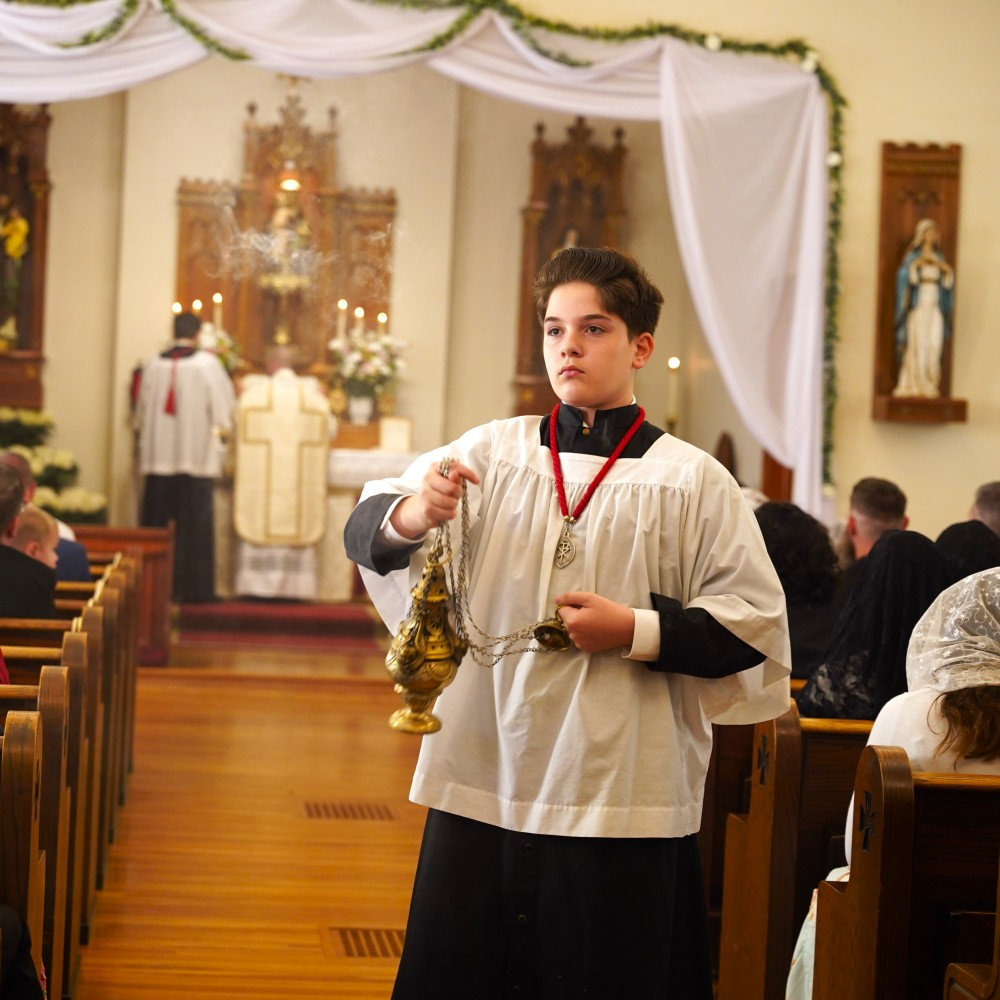
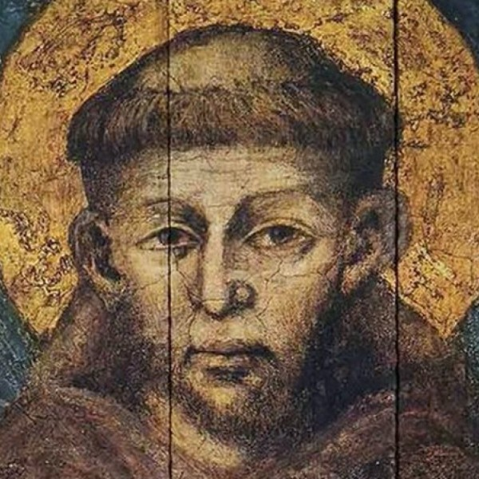
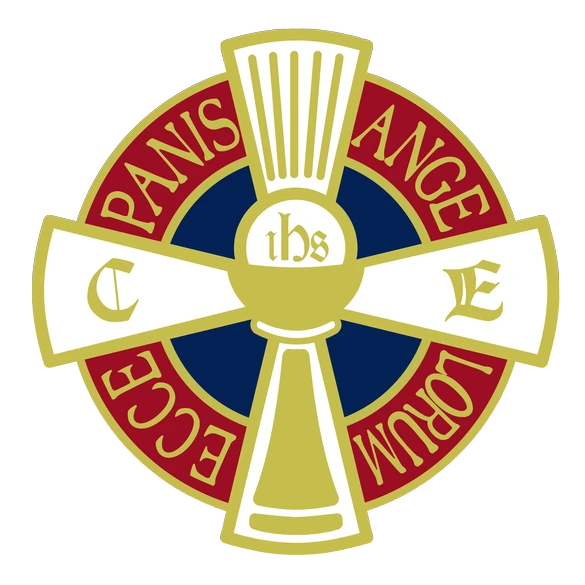

By God's grace, our faithful sacrifice their time and talent for the glory of God and the
fullness of Catholic life.

## Holy Name Society 

Tracing its roots to the Council of Lyons in 1274, the Holy Name Society (<abbr>HNS</abbr>)
exists to promote reverence for the Holy Name, loyalty to the Magisterium and Traditions
of the Catholic Church, and the personal sanctification of its members.

At Saint Anthony's, Holy Name men are responsible for assisting our priest and coordinator in all
aspects of the governance and operation of our chapel.

Two thirds of the men at Saint Anthony's belong to the HNS. Distinguished by their *Chi-Rho* (☧)
lapel pins, you will find them at work everywhere: ushering, singing for Holy Mass, taking out
the garbage, and landscaping the churchyard.

The Holy Name Society has two primary goals:

1. Helping its members grow in personal holiness
2. Serving the faithful of Saint Anthony's.

The Holy Name Society meets on First Saturdays at 6:00 PM in the Social Hall. Catholic men of
all ages are encouraged to attend.
For more information, [contact our HNS secretary](mailto:jimdepiante@gmail.com).

## Altar Rosary Society 

Under the Confraternity of the Most Holy Rosary, the Altar Rosary Society (ARS) assists
our priest and Sacristan in caring for all the items necessary for the celebration of Holy Mass.

The women of the ARS are the hearts and hands that fashion our church building into a true
spiritual home. In addition to devoutly praying the Holy Rosary, they distribute sacramentals,
care for clerical vestments, launder altar linens, arrange flowers, and keep the sacristy well
organized.

The Altar Rosary Society is open to all Catholic women.
For more information, [contact our Communications Team](mailto:communications@saintanthonys.com).

## Sacred Music 

Music is an integral part of life at Saint Anthony's. The sounds of Gregorian chant, sacred
polyphony, and traditional Catholic hymnody fill our chapel each week. By God's grace, our
music program is staffed exclusively by volunteers dedicated to the best of the Catholic
musical tradition.

### Schola Cantorum

Founded in 2001, the *Schola Cantorum* supplies all liturgical music prescribed by Holy
Mother Church.
In addition to providing a full sung Mass every Sunday and Holy Day, they sing Matins of
Christmas and the entire Sacred Triduum each year.

The Schola is open to male singers and practices every Sunday at 9:15 AM.

### Saint Anthony's Choir

The Saint Anthony's Choir augments most of our sung Masses with the best of traditional
Catholic polyphony. In addition to classic composers like Palestrina, Victoria, and Byrd,
the choir even sings occasional compositions by our own faithful.

The Saint Anthony's Choir is open to both men and women. Practice is held every Sunday
after the 10:00 AM Mass.

### Children's Music

Our Children's Choir is instructed in the essentials of Gregrorian chant. Open to all boys
and girls, they sing the common parts of the Mass once a month and practice weekly after
the 10:00 AM Mass.

Our *Schola Puerorum*, or Boys' Schola, is a smaller group which commits to a more
intensive study of chant and sings the Mass propers on special occasions.
The *Schola Puerorum* is open to all boys and meets after Children's Choir practice each week.

Interested in joining one of our music programs?
[Contact our director](mailto:jimdepiante@gmail.com), or simply stop by the choir room whenever music can be heard!

## Archconfraternity of Saint Stephen 

> "To serve at the altar is the highest privilege which a layman can enjoy."

The [Archconfraternity of Saint Stephen](https://sspx.au/en/archconfraternity-saint-stephen-33368)
was founded in 1905 to encourage the personal holiness of altar servers and instruct them in
the rites and ceremonies of the Church.

The Guild encourages piety and discipline through adherence to its four rules:

1. To serve at the altar reverently
2. To make acts of preparation and thanksgiving before and after Mass
3. To observe reverence in the sacristy and Sanctuary
4. To recite daily the Guild prayer.

The Archconfraternity is open to all boys and men able to serve Holy Mass.
For more information, [contact our Communications Team](mailto:communications@saintanthonys.com).

## Third Order of Saint Francis 

The [Franciscan Third Order](https://sspx.org/en/third-order-st-francis-info-30312)
is an ecclesiastical association of laity founded by Saint Francis of Assisi.
Franciscan Tertiaries live in the spirit of poverty, chastity, and obedience in the
secular world while striving for Christian perfection through their Rule of Life.

Our Third Order Franciscans meet on second Sundays in the chapel after the 10:00 AM Mass.
For more information, [contact our Communications Team](mailto:communications@saintanthonys.com).

## Eucharistic Crusade 

The [Eucharistic Crusade](https://fsspx.org/en/eucharistic-crusade-30952)
is a mobilization of the prayers of children.
As they advance through the ranks of *Page*, *Crusader*, and *Knight*, our Crusaders offer
their prayers, sacrifices, Holy Communions, and good works for the intentions of Holy Mother
Church.

The Saint Anthony's chapter of the Eucharistic Crusade meets on First Saturdays after the
evening Mass. To enroll your child,
[contact our Eucharistic Crusade leaders](mailto:ec@saintanthonys.com).

## Ushers 

Our ushers are the welcoming face of Saint Anthony's. Trained in hospitality,
security, and first aid, they demonstrate a culture of Christian charity to all
who seek spiritual solace at our chapel.

Perhaps most importantly, they ensure all vistors manage to find a seat at our increasingly
well-attended liturgies.

The usher team meets every First Saturday after the Holy Name Society meeting.
It's a good time to be an usher!
