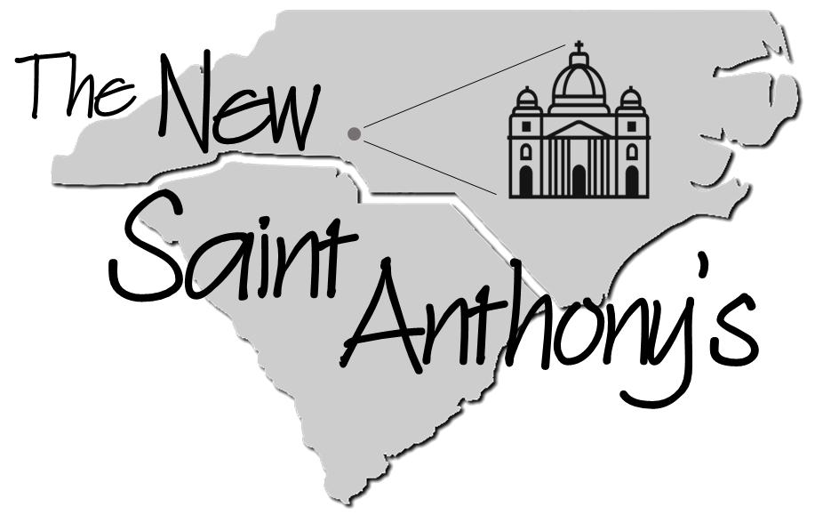

By God's grace, our community has grown steadily ever since our [founding](/about/) in 1981.
As Charlotte has overflowed with faith, families, and vocations, so too has our small chapel.

To accomodate our expanding congregation, the General Council of the SSPX in Switzerland has
authorized us to purchase a property on which to build a new church complex.

<a class="action large donate" title="Donate to the New Saint Anthony's" href="#/fundraising/forms/PYEVM6DX"><i class="fa-solid fa-gift fa-xl"></i>Donate Now</a>

## Help build a new home for Tradition!{.noclear}

The time has come to build a new home for Tradition in the Carolinas: a church worthy to sustain
us and our descendants with the fullness of Catholic life.

> We will create a place of lasting permanence and distinct beauty.
> It will glorify God in its magnificence, and it will serve as a font
> of sacramental grace and Christian life for His people for countless generations.
> It will be the seedbed of saints.

Realizing this vision depends first and foremost on your prayers, but also
on your financial support.
To help us obtain this property, consider [making your contribution](#/fundraising/forms/PYEVM6DX) to our capital campaign.

## Considering a major contribution?

If you are considering a major contribution for The New Saint Anthony's, we warmly invite you to contact our fundraising chairman, Mr. Chris Lauer:

<ul class="action-list">
  <li><a title="Call the New Saint Anthony's Team" href="tel:+19805018672"><i class="fa-solid fa-phone fa-lg"></i>(980) 501-8672</a></li>
  <li><a title="Email the New Saint Anthony's Team" href="mailto:build@saintanthonys.com?subject=Please contact me about The New Saint Anthony's&body=Dear Mr. Lauer,%0D%0A%0D%0AI am considering making a major contribution to The New Saint Anthony's.%0D%0A%0D%0ACan you please contact me and tell me more?"><i class="fa-regular fa-paper-plane fa-lg"></i>build@saintanthonys.com</a></li>
</ul>

## Be the first to know.

To get the latest updates on our building project, subscribe to the *New Saint Anthony's* interest list:

<form method="post" action="https://gaggle.email/join/nsa@gaggle.email">
  <input name="name" type="text" placeholder="Your Name" title="First and last name" pattern="[^\s]+\s+[^\s]+.*" autocomplete="name" required/> 
  <input name="email" type="email" placeholder="you@example.com" title="Email address" autocomplete="email" required/> 
  <button type="submit"><i class="fa fa-circle-arrow-right fa-lg"></i> Subscribe!</button>
</form>
