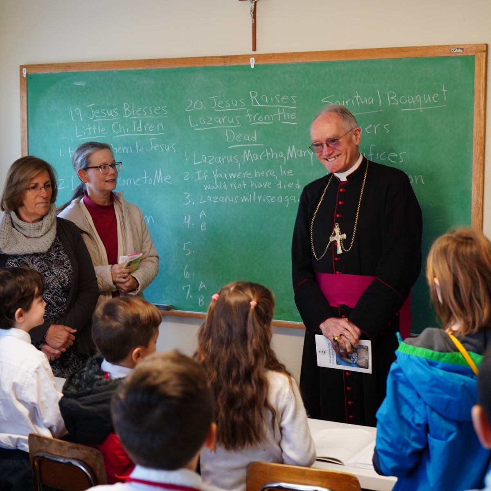

Saint Anthony's offers weekly education in the traditional Faith to Catholics of all ages.

## Youth Catechism 

Our religious education program is designed to accompany children through every
stage of the sacramental life. Each of our classes draws exclusively from traditional
Catholic resources and texts.

- Post-Baptism (ages 3-5)
- First Communion Prep (ages 6-7)
- Post-First Communion (ages 8-10)
- Confirmation Prep (ages 11-12)
- Post-Confirmation Middle School (grades 6-8)
- Post-Confirmation High School (grades 9-12)

For more information, [contact our Communications Team](mailto:communications@saintanthonys.com).

Classes meet on Sundays at 9:00 AM. Enroll your child today!

<a class="action" title="Youth Catechism Registration Form" href="https://docs.google.com/forms/d/e/1FAIpQLSdXEReGJSnF_kwUwLKQALiJZUlvDc-6yB0KIvJEFLZ1s5fTuw/viewform"><i class="fa-regular fa-clipboard fa-xl"></i>Enroll Now</a>

## Adult Catechism

All adults are invited to continue their Catholic education in our Adult Catechism program.

Classes meet on Sundays at 9:00 AM in the Social Hall. No registration is necessary!

## Convert Catechism

Our Convert Catechism program provides personal instruction to non-Catholics seeking communion
with the Holy Catholic Church.

[Contact our Communications Team](mailto:communications@saintanthonys.com) for information about
becoming Catholic at Saint Anthony's.
