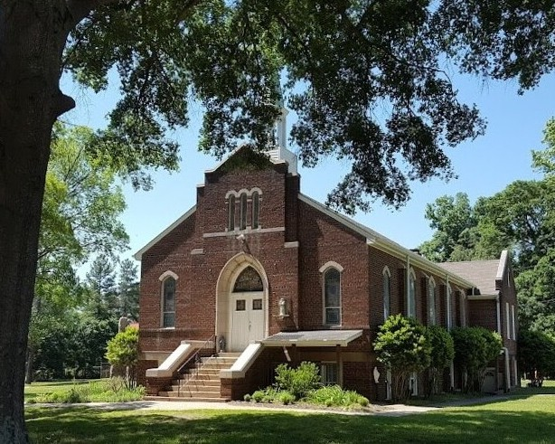

Saint Anthony's is a Catholic chapel served by the [Society of Saint Pius X](https://sspx.org/en).
Centrally located near Charlotte, NC, we offer the Traditional Latin Mass and
all Sacraments according to the 1962 Roman Missal.

  

  <h2>Mass Times</h2>
    <table class="schedule">
      <tr><td><h3>Saturday</h3></td></tr>
      <tr>
        <td>4:00 PM</td>
        <td>Adoration *(First Saturdays)*</td>
      </tr>
      <tr>
        <td>4:15 PM</td>
        <td>Confessions</td>
      </tr>
      <tr>
        <td>5:00 PM</td>
        <td>Low Mass</td>
      </tr>
      <tr><td><h3>Sunday</h3></td></tr>
      <tr>
        <td>7:30 AM</td>
        <td>Confessions</td>
      </tr>
      <tr>
        <td>8:00 AM</td>
        <td>Low Mass</td>
      </tr>
      <tr>
        <td>9:15 AM</td>
        <td>Confessions</td>
      </tr>
      <tr>
        <td>10:00 AM</td>
        <td>Sung Mass</td>
      </tr>
    </table>
  

  

    
     
    <a title="Find us on Google Maps" href="https://maps.app.goo.gl/oH9FD6qn2CoqQiAh9"><i class="fa-solid fa-location-dot"></i>108 Horseshoe Bend Beach Road, Mount Holly, NC</a>
  

  

  <h2>Subscribe!</h2>
  To receive bulletins, chapel news, and announcements straight to your inbox:
  <a class="action" title="Gaggle mailing list" href="https://gaggle.email/join/nsa@gaggle.email"><i class="fa-regular fa-envelope fa-xl"></i>Join our Mailing List</a>

  <h2>Events</h2>
  Something is always happening at Saint Anthony's. Check out our full schedule:
  <a class="action" title="Google Calendar" href="https://calendar.google.com/calendar/embed?src=saintanthonycommunications%40gmail.com&ctz=America%2FNew_York"><i class="fa-regular fa-calendar fa-xl"></i>View our Google Calendar</a>
  

## News

The New Saint Anthony's
: The General Council of the SSPX has approved our plans to identify and purchase a property on which to build *The New Saint Anthony's*.
  As you have likely noticed, our chapel is experiencing significant growth. Please pray for our success in locating a suitable
  property!

Nocturnal Adoration on December 6
: The Holy Name Society is sponsoring all-night Adoration beginning Saturday, December 6 at 8:00 PM.
  [Sign up for your holy hour](https://www.signupgenius.com/go/10C0B45ADA62BA1F5C07-49683297-nocturnal#/) with Our Lord in the Blessed Sacrament.
  Adoration ends with Benediction at 7:00 AM.

Immaculate Conception: Holy Day of Obligation on December 8
: Monday, December 8, the feast of the Immaculate Conception, is a Holy Day of Obligation.
  <table class="schedule">
    <tr><td>6:00 PM</td><td>Confession</td></tr>
    <tr><td>7:00 PM</td><td>Sung Mass</td></tr>
  </table>

Christmas at Saint Anthony's
: The liturgical season of Christmas begins on December 24 with sung Matins, Midnight Mass, and our annual Christmas celebration.
  Bring a favorite snack, treat, or beverage to share. Signups are located in the vestibule.
  

  

  <table class="schedule">
    <tr><td>9:00 PM</td><td>Matins of Christmas</td></tr>
    <tr><td>11:00 PM</td><td>Confessions</td></tr>
    <tr><td>12:00 AM</td><td>Midnight Mass</td></tr>
    <tr><td>2:00 AM</td><td>Christmas Celebration</td></tr>
  </table>
  

  

  <table class="schedule">
    <tr><td>8:00 AM</td><td>Confessions</td></tr>
    <tr><td>9:00 AM</td><td>Low Mass</td></tr>
  </table>
  

  

## Follow Us

For pictures and videos of Catholic life at Saint Anthony's, follow us on social media:

<ul class="social-buttons">
  <li><a title="Instagram" href="https://www.instagram.com/sapcarolinas/"><i class="fa-brands fa-instagram fa-xl"></i>SAPCarolinas</a></li>
  <li><a title="Facebook" href="https://www.facebook.com/SAPCarolinas"><i class="fa-brands fa-facebook fa-xl"></i>SAPCarolinas</a></li>
  <li><a title="X/Twitter" href="https://x.com/SAPCarolinas"><i class="fa-brands fa-x-twitter fa-xl"></i>SAPCarolinas</a></li>
  <li><a title="Flickr" href="https://www.flickr.com/photos/198440044@N08/albums"><i class="fa-brands fa-flickr fa-xl"></i>Flickr</a></li>
</ul>

## Giving

You can [donate to Saint Anthony's](https://www.paypal.com/donate/?hosted_button_id=376XR694NLM5N "donate via PayPal") using PayPal. Thank you for your generosity!

## Contact Us 

<ul class="action-list">
  <li><a title="Chat with us on Facebook Messenger" href="https://m.me/sapcarolinas"><i class="fa-regular fa-message fa-lg"></i>Facebook Messenger</a></li>
  <li><a title="Email our Communications Team" href="mailto:communications@saintanthonys.com"><i class="fa-regular fa-paper-plane fa-lg"></i>communications@saintanthonys.com</a></li>
  <li><a title="Visit our official SSPX website" href="https://fsspx.today/chapel/nc-charlotte/info/"><i class="fa-solid fa-globe fa-lg"></i>SSPX Chapel Homepage</a></li>
  <li><a title="Call the chapel" href="tel:+17048278676"><i class="fa-solid fa-phone fa-lg"></i>(704) 827-8676</a></li>
</ul>
